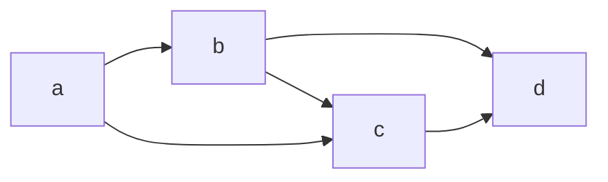
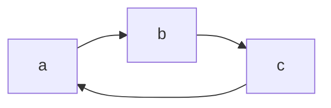

# Tango: C build tool

Tango is a modern build tool for the c programming language. It configures specific targets inside a project directory which can configure the input files or directories, the output location, include-paths, and library links (static and shared). Each target compiles to an executable, a static library, or a shared library. Linking to a static or shared library of another target inside the directory is also possible by establishing dependencies between targets.

## Installation

Currently, I only support a macOS version but a Linux version is planned soon and Windows support will be added at a later time.

### Darwin

1. Clone this directory to the desired location on your machine. 
`git clone https://github.com/paauuuleee/tango.git`
2. Change directory into newly cloned directory and execute `./install.zsh` (This will append the `tango/bin` directory to your `$PATH` environment variable, your machine can execute `tango` form every directory. The installation changes are going to be stored in your `~/.zshrc` file.)

## Documentation

Tango works simuilar to other build tools. You type the `$ tango` command and follow up with a desired subcommand. By typing `$ tango --help` you get a description of the Usage of `tango` and all its available subcommands.

```
`Tango is a modern build tool for c language targets

Usage:

    tango <cmd> [args] {opts}

Commands:

    init     Initialises the directory to tango
    new      Creates a new c target
    build    Builds the target
    add      Adds source files to the target comilation
    add-dir  Adds a directory of source files to the target
    inc      Sets an include path
    link     Links static and dynamic libraries (can also link to other target)
    depend   Makes building a target dependend on another target built
    log      Gives a status update on configuration of target
    ls       Lists all the targets in the directory
    rm       Removes any compile element in the target via its hash

Type "--help" after unclear command and recieve an in depth explanation`
```

### Init command

The init command initialises a project directory (the directory you are currently in) to tango. This creates a `.tango` directory inside the project directory. Inside `.tango` you will find all created target configuration files with the suffix `*.tango`.

### New command

The new command creates a new target for the project. The first argument of `> tango new` has to be the name of the new target. Every command that modifies the target, requires the same convetion. A valid name for a target can only contain english letters and arabic digits and has to start with a letter. If it is an executable target, this will also be the executable name. If it is a static or shared library target, the library name will be `lib(target-name).a` or `lib(target-name).dylib` respectively. The second argument of the command must be a valid compilation destination. Lastly, you have to define if the target is an executable target, a static, or a shared target, by using the `--exec`, `--static`, `--shared` options at the end of the command respectively. Your `(target-name).tango` file will be created inside the `.tango` directory.

If the project directory is not already initialised to tango the new command will implicitly initialise the directory.

### Add command

The add command adds a c source file as an input file to the target compilation. The first argument of `> tango add` must be the name of an existing target. The second argument must be the path to an existing c file. If the file was already added to the target, the command is ignored.

### Add-dir command

The add-dir command works simuilar to the add command but it adds a source directory to the compilation. The first argument of `> tango add-dir` must be the name of an existing target. The second argument must be the path to an existing directory. When building the target, `tango` gets the path to every c file in that directory and adds it to the compilation.

### Inc command

The inc command adds a include-path to the target. The first argument of `> tango inc` has to be the name of an existing target. The second argument must be path to and existing directory.

### Depend command

The depend command adds another target to the dependency list and makes sure that this dependency target is built before the dependend target. The first argument of `> tango depend` must be the name of an existing target. The second argument must be the name of another existing target inside this project directory, which the first target then depends on. With several targets depending on each other this creates a dependency network.

Lets suppose, we have four targets: `a`, `b`, `c`, `d`
1. Target `a` depends on targets `b` and `c`
2. Target `b` depends on targets `c` and `d`
3. Target `c` depends on traget `d`
4. Target `d` has no dependencies

The follwoing network would look like this.


### Link command

The link command links a static or shared library to a target. The first argument of `> tango link` has to be the name of an existing target. The second argument must be a path to an existing library file. If the file type of the library is an archive file (static library with suffix `*.a`), it links this library statically and the following option passed to the link command must be `--static`. If the file type of the library is a shared library (with suffix `*.dylib`), it can either be linked with the absolute path or the relative path to the final target compilation destination, with the options `--absolute` or `--relative` respectively.

If you want to link to a library that does not yet exist because it is build by another target in the project directory, the second argument of the `> tango link` command must be `target:(target-name)` and the target name must be of the target that builds the desired library. Naturally, the target type of that target must either be `static` or `shared`, for a static or shared library. The last option of the link command must be `--static` for a static library target and `--realtive` or `--absolute` for a shared library target. With the name of the linked target and its compilation destination a file path to the future library is constructed. Since this target depends on the linked target to be build first, the linked target is added as a dependency automatically without needing the `$ tango depend` command.

### Build command

The build command builds a target and ensures that all dependency targets are built befor that. The only argument of the `> tango build` command is the target that is desired to be built. The build command works in two steps.

1. All targets that the desired target depends on are accessed and all the targets they depend on are accessed as well until all targets in the dependecy network are accessed. Then the network is collapsed into a dependency list that does not violate any dependency constraints between the targets. This process also detects depend cicle errors.
A illegal depend cycle would be:

In this case you cannot build one of the targets, because the target dependencies depend themselves depend on the on target that you are trying to build.


2. Every target in the dependency list is consecutively built with all the input files, include-paths, links to static and shared libraries to the desired building location as the desired building type until the desired target is built.


### Ls command

The ls command lists all targets in a project directory and also shows all dependencies for each target. It does not require any arguments.

### Log command

The log command gives a status update on the configuration of a specific target. The only argument of the `> tango log` command must be the name of the target you desire to log. It also generates a hash for each element which is necessary to remove compile elements

### Rm command

The rm command allows the user to remove compile elemets form the target (source files, source directories, include paths, static and shared library links, dependencies). The first argument of `> tango rm` has to be the name of an existing target. The second argument must be the hash of the element, you want to remove. The log command returns the necessary hashes. If you want to remove a dependency that is used to provide a statically or dynamically library to the compilation path, this error is going to be detected. To remove it anyway, you have to use the `--force` option at the end of the command.

## Warnings

The tango build tool is still in development
